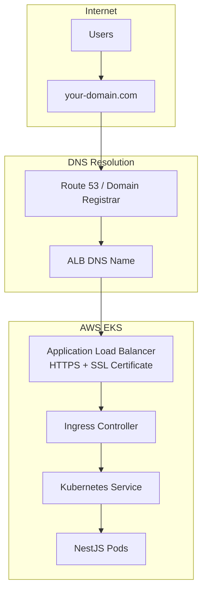

# 🌐 Domain Setup Guide for AWS EKS

This guide shows you how to add your custom domain to your NestJS application running on AWS EKS.

## 📋 Prerequisites

- Your domain registered (e.g., GoDaddy, Namecheap, Route 53)
- AWS EKS cluster running
- NestJS application deployed

## 🎯 **Method 1: Using Route 53 (Recommended)**

### Step 1: Create Hosted Zone in Route 53

```bash
# Create hosted zone for your domain
aws route53 create-hosted-zone \
  --name your-domain.com \
  --caller-reference $(date +%s) \
  --region ap-south-1
```

### Step 2: Get Name Servers

```bash
# Get the name servers for your domain
aws route53 get-hosted-zone --id YOUR-HOSTED-ZONE-ID
```

### Step 3: Update Domain Registrar

1. **Go to your domain registrar** (GoDaddy, Namecheap, etc.)
2. **Update nameservers** to the ones from Route 53
3. **Wait for propagation** (can take 24-48 hours)

### Step 4: Create SSL Certificate

```bash
# Request SSL certificate
aws acm request-certificate \
  --domain-name your-domain.com \
  --subject-alternative-names "*.your-domain.com" \
  --validation-method DNS \
  --region ap-south-1
```

### Step 5: Validate Certificate

```bash
# Get certificate ARN
aws acm list-certificates --region ap-south-1

# Get validation records
aws acm describe-certificate \
  --certificate-arn "arn:aws:acm:ap-south-1:YOUR-ACCOUNT-ID:certificate/YOUR-CERT-ID" \
  --region ap-south-1
```

### Step 6: Update Helm Values

```yaml
# helm-chart/values.yaml
ingress:
  enabled: true
  className: "alb"
  annotations:
    kubernetes.io/ingress.class: "alb"
    alb.ingress.kubernetes.io/scheme: internet-facing
    alb.ingress.kubernetes.io/target-type: ip
    alb.ingress.kubernetes.io/healthcheck-path: /health
    alb.ingress.kubernetes.io/certificate-arn: "arn:aws:acm:ap-south-1:YOUR-ACCOUNT-ID:certificate/YOUR-CERT-ID"
    alb.ingress.kubernetes.io/ssl-redirect: "443"
  hosts:
    - host: your-domain.com
      paths:
        - path: /
          pathType: Prefix
```

### Step 7: Deploy with Updated Domain

```bash
# Deploy with your domain
helm upgrade nestjs-app ./helm-chart \
  --namespace nestjs-prod \
  --set ingress.hosts[0].host=your-domain.com \
  --set ingress.annotations."alb\.ingress\.kubernetes\.io/certificate-arn"="arn:aws:acm:ap-south-1:YOUR-ACCOUNT-ID:certificate/YOUR-CERT-ID"
```

## 🎯 **Method 2: Using External DNS (Alternative)**

### Step 1: Install External DNS

```bash
# Add External DNS Helm repository
helm repo add external-dns https://kubernetes-sigs.github.io/external-dns/
helm repo update

# Install External DNS
helm install external-dns external-dns/external-dns \
  --namespace external-dns \
  --create-namespace \
  --set provider=aws \
  --set aws.region=ap-south-1 \
  --set aws.zoneType=public \
  --set txtOwnerId=your-cluster-name
```

### Step 2: Update Ingress with External DNS

```yaml
# helm-chart/values.yaml
ingress:
  enabled: true
  className: "alb"
  annotations:
    kubernetes.io/ingress.class: "alb"
    alb.ingress.kubernetes.io/scheme: internet-facing
    alb.ingress.kubernetes.io/target-type: ip
    alb.ingress.kubernetes.io/healthcheck-path: /health
    alb.ingress.kubernetes.io/certificate-arn: "arn:aws:acm:ap-south-1:YOUR-ACCOUNT-ID:certificate/YOUR-CERT-ID"
    alb.ingress.kubernetes.io/ssl-redirect: "443"
    external-dns.alpha.kubernetes.io/hostname: "your-domain.com"
  hosts:
    - host: your-domain.com
      paths:
        - path: /
          pathType: Prefix
```

## 🎯 **Method 3: Manual DNS Configuration**

### Step 1: Get Load Balancer DNS Name

```bash
# Get the ALB DNS name
kubectl get ingress nestjs-app -n nestjs-prod -o jsonpath='{.status.loadBalancer.ingress[0].hostname}'
```

### Step 2: Create DNS Records

#### **Option A: A Record (IPv4)**
```
Type: A
Name: @
Value: ALB-IP-ADDRESS
TTL: 300
```

#### **Option B: CNAME Record (Recommended)**
```
Type: CNAME
Name: @
Value: your-alb-dns-name.elb.amazonaws.com
TTL: 300
```

#### **Option C: Subdomain**
```
Type: CNAME
Name: api
Value: your-alb-dns-name.elb.amazonaws.com
TTL: 300
```

## 🔧 **Complete Domain Configuration**

### **Updated Architecture with Domain:**



### **Domain Flow:**

1. **User types**: `https://your-domain.com/api/users`
2. **DNS resolves**: `your-domain.com` → ALB IP address
3. **ALB receives**: HTTPS request with SSL certificate
4. **Ingress routes**: `/api` → NestJS service
5. **NestJS responds**: Application logic
6. **ALB returns**: HTTPS response to user

## 🚀 **Deployment Commands**

### **Deploy with Domain:**

```bash
# Method 1: Update values.yaml and deploy
helm upgrade nestjs-app ./helm-chart --namespace nestjs-prod

# Method 2: Deploy with specific domain
helm upgrade nestjs-app ./helm-chart \
  --namespace nestjs-prod \
  --set ingress.hosts[0].host=your-domain.com \
  --set ingress.annotations."alb\.ingress\.kubernetes\.io/certificate-arn"="YOUR-CERT-ARN"
```

### **Verify Domain Setup:**

```bash
# Check ingress status
kubectl get ingress -n nestjs-prod

# Check ALB DNS name
kubectl describe ingress nestjs-app -n nestjs-prod

# Test domain resolution
nslookup your-domain.com

# Test HTTPS
curl -I https://your-domain.com/health
```

## 🔐 **SSL Certificate Options**

### **Option 1: AWS Certificate Manager (Free)**
- **Cost**: Free
- **Auto-renewal**: Yes
- **Validation**: DNS or Email
- **Wildcard**: Supported

### **Option 2: Let's Encrypt (Free)**
- **Cost**: Free
- **Auto-renewal**: Yes (with cert-manager)
- **Validation**: HTTP or DNS
- **Wildcard**: Supported

### **Option 3: Commercial Certificate**
- **Cost**: $50-500/year
- **Auto-renewal**: Manual
- **Validation**: Organization validation
- **Wildcard**: Supported

## 📊 **Domain Configuration Examples**

### **Single Domain:**
```yaml
ingress:
  hosts:
    - host: your-domain.com
      paths:
        - path: /
          pathType: Prefix
```

### **Multiple Domains:**
```yaml
ingress:
  hosts:
    - host: your-domain.com
      paths:
        - path: /
          pathType: Prefix
    - host: api.your-domain.com
      paths:
        - path: /
          pathType: Prefix
```

### **Subdomain with Path:**
```yaml
ingress:
  hosts:
    - host: your-domain.com
      paths:
        - path: /api
          pathType: Prefix
        - path: /admin
          pathType: Prefix
```

## 🎯 **Best Practices**

1. **Use Route 53** for DNS management
2. **Enable SSL redirect** (HTTP → HTTPS)
3. **Use wildcard certificates** for subdomains
4. **Set appropriate TTL** (300 seconds)
5. **Monitor certificate expiration**
6. **Use health checks** for reliability

## 🔍 **Troubleshooting**

### **Common Issues:**

1. **Domain not resolving**: Check DNS propagation
2. **SSL certificate errors**: Verify certificate ARN
3. **ALB not accessible**: Check security groups
4. **Ingress not working**: Verify annotations

### **Debug Commands:**

```bash
# Check DNS resolution
dig your-domain.com
nslookup your-domain.com

# Check SSL certificate
openssl s_client -connect your-domain.com:443 -servername your-domain.com

# Check ALB status
aws elbv2 describe-load-balancers --region ap-south-1

# Check ingress logs
kubectl logs -n kube-system -l app.kubernetes.io/name=aws-load-balancer-controller
```

This setup will give you a professional domain with HTTPS support for your NestJS application! 🚀
