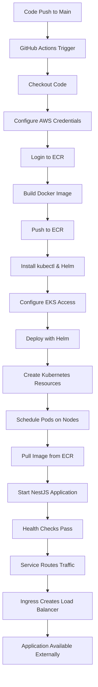

# 🚀 GitHub Actions to Kubernetes Deployment Process

This document explains the complete step-by-step process from GitHub Actions to running your NestJS application in a Kubernetes cluster.

## 📋 Overview

When you push code to the `main` branch, GitHub Actions automatically:
1. Builds your Docker image
2. Pushes it to AWS ECR
3. Deploys it to AWS EKS using Helm
4. Verifies the deployment

## 🔄 Complete Process Flow

### Phase 1: GitHub Actions Workflow Execution

#### Step 1: Code Push Triggers Workflow
```bash
# When you push to main branch
git push origin main
```

**What happens**: GitHub Actions detects the push and starts the workflow defined in `.github/workflows/deploy-prod.yml`

#### Step 2: GitHub Actions Starts
```yaml
# .github/workflows/deploy-prod.yml triggers
on:
  push:
    branches: [ main ]
```

**What happens**: GitHub Actions creates a new runner (Ubuntu VM) and starts executing the workflow

#### Step 3: Checkout Code
```yaml
- name: Checkout code
  uses: actions/checkout@v4
```

**What happens**: 
- Downloads your repository code to the GitHub runner
- Makes it available for the build process

#### Step 4: Configure AWS Credentials
```yaml
- name: Configure AWS credentials
  uses: aws-actions/configure-aws-credentials@v4
  with:
    aws-access-key-id: ${{ secrets.AWS_ACCESS_KEY_ID }}
    aws-secret-access-key: ${{ secrets.AWS_SECRET_ACCESS_KEY }}
    aws-region: ap-south-1
```

**What happens**: 
- Sets up AWS CLI on the runner
- Configures authentication using your GitHub secrets
- Enables access to AWS services (ECR, EKS)

#### Step 5: Login to Amazon ECR
```yaml
- name: Login to Amazon ECR
  id: login-ecr
  uses: aws-actions/amazon-ecr-login@v2
```

**What happens**: 
- Authenticates with AWS ECR (Elastic Container Registry)
- Gets temporary credentials for pushing/pulling Docker images
- Stores registry URL for later use

#### Step 6: Build and Push Docker Image
```yaml
- name: Build, tag, and push image to Amazon ECR
  env:
    ECR_REGISTRY: ${{ steps.login-ecr.outputs.registry }}
    ECR_REPOSITORY: nestjs-app-ecr
    IMAGE_TAG: ${{ github.sha }}
  run: |
    # Build a Docker image
    docker build -t $ECR_REGISTRY/$ECR_REPOSITORY:$IMAGE_TAG .
    docker build -t $ECR_REGISTRY/$ECR_REPOSITORY:latest .
    
    # Push the image
    docker push $ECR_REGISTRY/$ECR_REPOSITORY:$IMAGE_TAG
    docker push $ECR_REGISTRY/$ECR_REPOSITORY:latest
```

**What happens**: 
- Builds your NestJS application into a Docker image using your `Dockerfile`
- Tags the image with:
  - Commit SHA (e.g., `abc123def456`)
  - `latest` tag
- Pushes both tagged images to AWS ECR

#### Step 7: Install Kubernetes Tools
```yaml
- name: Install kubectl
  uses: azure/setup-kubectl@v3
  with:
    version: 'v1.28.0'
    
- name: Install Helm
  uses: azure/setup-helm@v3
  with:
    version: 'v3.12.0'
```

**What happens**: 
- Downloads and installs `kubectl` (Kubernetes command-line tool)
- Downloads and installs `helm` (Kubernetes package manager)
- Both tools are now available on the runner

#### Step 8: Configure EKS Access
```yaml
- name: Configure kubectl for EKS
  run: |
    aws eks update-kubeconfig --region ap-south-1 --name nestjs-prod
```

**What happens**: 
- Configures `kubectl` to connect to your AWS EKS cluster
- Downloads cluster credentials and configuration
- Enables the runner to manage your Kubernetes cluster

### Phase 2: Kubernetes Deployment

#### Step 9: Deploy with Helm
```yaml
- name: Deploy to EKS using Helm
  run: |
    # Update Helm values with new image tag
    helm upgrade --install nestjs-app ./helm-chart \
      --namespace nestjs-prod \
      --create-namespace \
      --set image.tag=${{ github.sha }} \
      --set image.repository=${{ env.ECR_REGISTRY }}/${{ env.ECR_REPOSITORY }} \
      --wait \
      --timeout=10m
```

**What happens**: 
- Helm reads your chart templates from `./helm-chart/`
- Generates Kubernetes YAML files using the templates and values
- Applies the generated YAML to your EKS cluster
- Creates or updates the `nestjs-app` release in the `nestjs-prod` namespace

#### Step 10: Helm Creates Kubernetes Resources

Helm processes your templates and creates these Kubernetes resources:

##### 10.1: Namespace
```yaml
apiVersion: v1
kind: Namespace
metadata:
  name: nestjs-prod
```

##### 10.2: Secret (Database Credentials)
```yaml
apiVersion: v1
kind: Secret
metadata:
  name: nestjs-app-secrets
  namespace: nestjs-prod
type: Opaque
data:
  DATABASE_USER: cG9zdGdyZXM=  # base64 encoded
  DATABASE_PASSWORD: cG9zdGdyZXM=  # base64 encoded
  JWT_SECRET: eW91ci1qd3Qtc2VjcmV0LWtleQ==  # base64 encoded
```

##### 10.3: ConfigMap (Non-sensitive Configuration)
```yaml
apiVersion: v1
kind: ConfigMap
metadata:
  name: nestjs-app-config
  namespace: nestjs-prod
data:
  NODE_ENV: "production"
  DATABASE_HOST: "postgres-service"
  DATABASE_PORT: "5432"
  DATABASE_NAME: "nestdb"
  REDIS_HOST: "redis-service"
  REDIS_PORT: "6379"
```

##### 10.4: Deployment (Your Application Pods)
```yaml
apiVersion: apps/v1
kind: Deployment
metadata:
  name: nestjs-app
  namespace: nestjs-prod
spec:
  replicas: 2
  selector:
    matchLabels:
      app: nestjs-app
  template:
    metadata:
      labels:
        app: nestjs-app
    spec:
      containers:
      - name: nestjs-app
        image: your-ecr-registry-url/nestjs-app-ecr:abc123def456
        ports:
        - containerPort: 3000
        env:
        - name: NODE_ENV
          valueFrom:
            configMapKeyRef:
              name: nestjs-app-config
              key: NODE_ENV
        - name: DATABASE_USER
          valueFrom:
            secretKeyRef:
              name: nestjs-app-secrets
              key: DATABASE_USER
        livenessProbe:
          httpGet:
            path: /health
            port: 3000
          initialDelaySeconds: 30
          periodSeconds: 10
        readinessProbe:
          httpGet:
            path: /health
            port: 3000
          initialDelaySeconds: 5
          periodSeconds: 5
```

##### 10.5: Service (Internal Load Balancer)
```yaml
apiVersion: v1
kind: Service
metadata:
  name: nestjs-app-service
  namespace: nestjs-prod
spec:
  selector:
    app: nestjs-app
  ports:
  - port: 80
    targetPort: 3000
  type: ClusterIP
```

##### 10.6: Ingress (External Load Balancer)
```yaml
apiVersion: networking.k8s.io/v1
kind: Ingress
metadata:
  name: nestjs-app-ingress
  namespace: nestjs-prod
  annotations:
    kubernetes.io/ingress.class: "alb"
    alb.ingress.kubernetes.io/scheme: internet-facing
spec:
  rules:
  - host: your-domain.com
    http:
      paths:
      - path: /
        pathType: Prefix
        backend:
          service:
            name: nestjs-app-service
            port:
              number: 80
```

##### 10.7: HorizontalPodAutoscaler (Auto-scaling)
```yaml
apiVersion: autoscaling/v2
kind: HorizontalPodAutoscaler
metadata:
  name: nestjs-app-hpa
  namespace: nestjs-prod
spec:
  scaleTargetRef:
    apiVersion: apps/v1
    kind: Deployment
    name: nestjs-app
  minReplicas: 2
  maxReplicas: 10
  metrics:
  - type: Resource
    resource:
      name: cpu
      target:
        type: Utilization
        averageUtilization: 70
```

#### Step 11: Kubernetes Scheduler Places Pods
**What happens**: 
- Kubernetes scheduler examines the deployment
- Finds available worker nodes in your EKS cluster
- Assigns pods to nodes based on resource requirements and constraints

#### Step 12: Pods Start and Pull Image
**What happens for each pod**: 
1. **Pending**: Pod is created but waiting for node assignment
2. **ContainerCreating**: Pod is assigned to a node, pulling image from ECR
3. **Running**: NestJS application starts inside the container
4. **Ready**: Health checks pass, pod is ready to receive traffic

#### Step 13: Service Routes Traffic
**What happens**: 
- Service creates an internal load balancer
- Routes incoming traffic to healthy pods
- Provides stable endpoint for your application

#### Step 14: Ingress Creates External Load Balancer
**What happens**: 
- Ingress controller creates an AWS Application Load Balancer (ALB)
- ALB provides external access to your application
- Routes traffic from the internet to your service

### Phase 3: Verification and Health Checks

#### Step 15: Verify Deployment
```yaml
- name: Verify deployment
  run: |
    kubectl get pods -n nestjs-prod
    kubectl get services -n nestjs-prod
    kubectl get ingress -n nestjs-prod
```

**What happens**: 
- Lists all pods in the namespace to ensure they're running
- Shows services to verify internal load balancing
- Displays ingress to check external load balancer status

#### Step 16: Health Check
```yaml
- name: Run health check
  run: |
    # Get the LoadBalancer URL
    EXTERNAL_IP=$(kubectl get ingress nestjs-app -n nestjs-prod -o jsonpath='{.status.loadBalancer.ingress[0].hostname}')
    if [ -n "$EXTERNAL_IP" ]; then
      echo "🌐 Application available at: http://$EXTERNAL_IP"
      # Wait for the load balancer to be ready
      sleep 60
      # Health check
      curl -f http://$EXTERNAL_IP/health || exit 1
    else
      echo "⚠️ LoadBalancer not ready yet"
    fi
```

**What happens**: 
- Gets the external URL of your application
- Waits for the load balancer to be fully provisioned
- Makes an HTTP request to your `/health` endpoint
- Verifies the application is responding correctly

#### Step 17: Deployment Status Notification
```yaml
- name: Notify deployment status
  if: always()
  run: |
    if [ ${{ job.status }} == 'success' ]; then
      echo "✅ Production deployment successful!"
      echo "🚀 Application deployed to EKS cluster: nestjs-prod"
    else
      echo "❌ Production deployment failed!"
    fi
```

**What happens**: 
- Reports the final status of the deployment
- Provides success or failure notification

## 🔄 Complete Flow Diagram



## 📊 What Happens in Kubernetes Cluster

### Resource Creation Order:
1. **Namespace** → `nestjs-prod`
2. **Secret** → Database credentials and JWT secret
3. **ConfigMap** → Application configuration
4. **Deployment** → Application pods (2 replicas)
5. **Service** → Internal load balancer
6. **Ingress** → External load balancer (AWS ALB)
7. **HPA** → Auto-scaling rules

### Pod Lifecycle:
1. **Pending** → Waiting for node assignment
2. **ContainerCreating** → Pulling image from ECR
3. **Running** → NestJS application started
4. **Ready** → Health checks passing

### Traffic Flow:
1. **User** → Internet
2. **Internet** → AWS Application Load Balancer
3. **Load Balancer** → Kubernetes Ingress
4. **Ingress** → Kubernetes Service
5. **Service** → NestJS Pods
6. **Pods** → External Databases (RDS/ElastiCache)

## ⏱️ Timeline

- **Code Push**: 0 seconds
- **Build & Push Image**: 2-3 minutes
- **Kubernetes Deployment**: 3-5 minutes
- **Load Balancer Provisioning**: 2-3 minutes
- **Total Time**: 7-11 minutes

## 🎯 Key Benefits

- **Automated**: Everything happens automatically on code push
- **Scalable**: HPA automatically scales based on load
- **High Availability**: Multiple pods across nodes
- **Secure**: Secrets managed by Kubernetes
- **Monitored**: Health checks ensure app is running
- **Rollback Ready**: Easy to rollback to previous versions

## 🔧 Troubleshooting

### Common Issues:

1. **Image Pull Errors**: Check ECR permissions and image tags
2. **Pod Startup Failures**: Check logs with `kubectl logs -f pod-name -n nestjs-prod`
3. **Service Not Accessible**: Verify ingress configuration and load balancer status
4. **Database Connection Issues**: Check secrets and network connectivity

### Useful Commands:

```bash
# Check pod status
kubectl get pods -n nestjs-prod

# View pod logs
kubectl logs -f deployment/nestjs-app -n nestjs-prod

# Check service endpoints
kubectl get endpoints -n nestjs-prod

# Verify ingress status
kubectl describe ingress nestjs-app -n nestjs-prod

# Check HPA status
kubectl get hpa -n nestjs-prod
```

This entire process ensures your NestJS application is automatically deployed to a production-ready, scalable Kubernetes environment! 🚀
