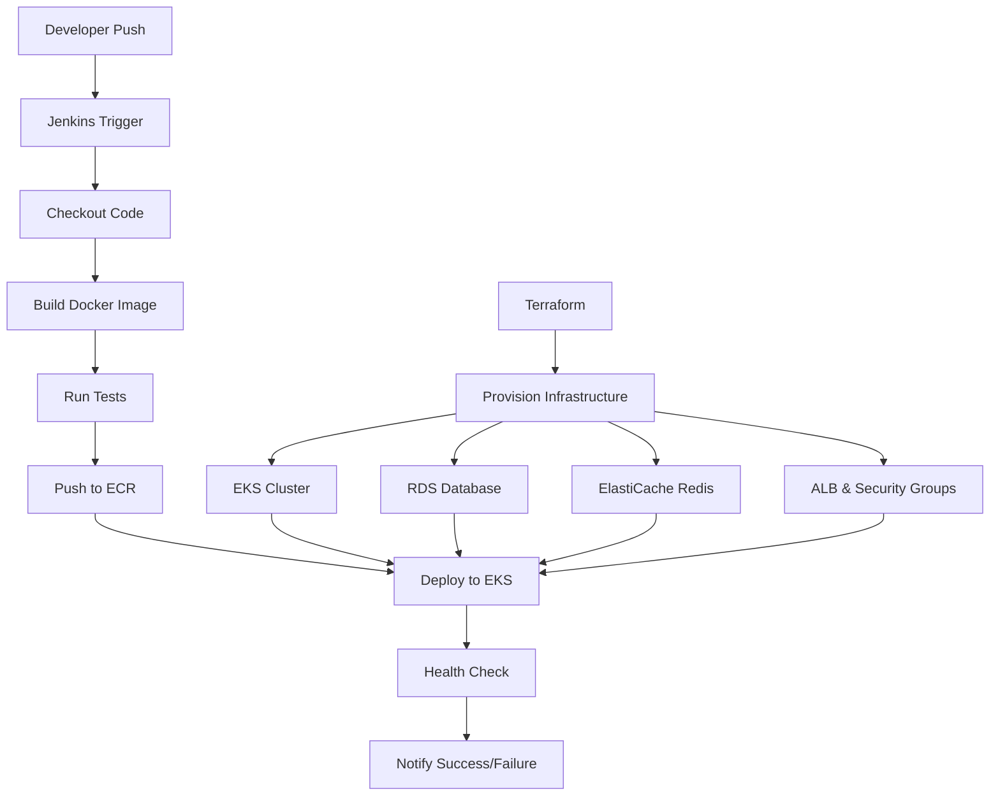
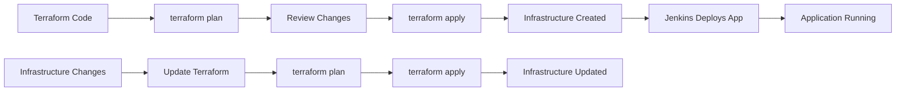

# 🏗️ Terraform & Jenkins Guide for bheji.com

Complete guide on how Terraform and Jenkins can enhance your NestJS application deployment and infrastructure management.

## 📋 Overview

This guide shows how to integrate:
- **Terraform**: Infrastructure as Code for AWS resources
- **Jenkins**: CI/CD automation server
- **Your Current Setup**: EKS, Helm, GitHub Actions

## 🏗️ **Part 1: Terraform for Infrastructure**

### **1.1 What Terraform Does for Your Application**

#### **Current Manual Process:**
```bash
# You manually create infrastructure
eksctl create cluster --name nestjs-prod --region ap-south-1
aws rds create-db-instance --db-instance-identifier nestjs-prod-db
aws elasticache create-cache-cluster --cache-cluster-id nestjs-prod-redis
```

#### **With Terraform (Automated):**
```hcl
# All infrastructure defined in code
# Version controlled
# Repeatable across environments
# State management
```

### **1.2 Terraform Benefits for bheji.com**

- ✅ **Version Control**: Infrastructure changes tracked in Git
- ✅ **Reproducible**: Same infrastructure across dev/staging/prod
- ✅ **State Management**: Terraform tracks what's deployed
- ✅ **Rollback**: Easy to revert infrastructure changes
- ✅ **Team Collaboration**: Multiple developers can manage infrastructure
- ✅ **Cost Optimization**: Better resource management

### **1.3 Terraform Structure for Your App**

```
terraform/
├── main.tf                 # Main configuration
├── variables.tf            # Input variables
├── outputs.tf              # Output values
├── terraform.tfvars        # Variable values
├── modules/
│   ├── eks/               # EKS cluster module
│   ├── rds/               # RDS database module
│   ├── redis/             # ElastiCache module
│   └── networking/        # VPC, subnets, security groups
└── environments/
    ├── dev/
    ├── staging/
    └── prod/
```

### **1.4 Example Terraform Configuration**

#### **main.tf - EKS Cluster**
```hcl
# EKS Cluster
resource "aws_eks_cluster" "nestjs_prod" {
  name     = var.cluster_name
  role_arn = aws_iam_role.eks_cluster.arn
  version  = "1.28"

  vpc_config {
    subnet_ids = aws_subnet.private[*].id
  }

  tags = {
    Environment = "production"
    Project     = "bheji"
    ManagedBy   = "terraform"
  }
}

# EKS Node Group
resource "aws_eks_node_group" "workers" {
  cluster_name    = aws_eks_cluster.nestjs_prod.name
  node_group_name = "workers"
  node_role_arn   = aws_iam_role.eks_nodes.arn
  subnet_ids      = aws_subnet.private[*].id

  scaling_config {
    desired_size = 2
    max_size     = 5
    min_size     = 1
  }

  instance_types = ["t3.medium"]
}
```

#### **main.tf - RDS Database**
```hcl
# RDS PostgreSQL
resource "aws_db_instance" "postgres" {
  identifier = "${var.project_name}-prod-db"
  engine     = "postgres"
  engine_version = "15.4"
  instance_class = "db.t3.micro"
  allocated_storage = 20
  storage_type = "gp2"

  db_name  = "nestdb"
  username = "postgres"
  password = var.db_password

  vpc_security_group_ids = [aws_security_group.rds.id]
  db_subnet_group_name   = aws_db_subnet_group.main.name

  backup_retention_period = 7
  backup_window          = "03:00-04:00"
  maintenance_window     = "sun:04:00-sun:05:00"

  skip_final_snapshot = false
  final_snapshot_identifier = "${var.project_name}-final-snapshot"

  tags = {
    Environment = "production"
    Project     = "bheji"
    ManagedBy   = "terraform"
  }
}
```

#### **main.tf - ElastiCache Redis**
```hcl
# ElastiCache Redis
resource "aws_elasticache_cluster" "redis" {
  cluster_id           = "${var.project_name}-prod-redis"
  engine               = "redis"
  node_type            = "cache.t3.micro"
  num_cache_nodes      = 1
  parameter_group_name = "default.redis7"
  port                 = 6379

  subnet_group_name = aws_elasticache_subnet_group.main.name
  security_group_ids = [aws_security_group.redis.id]

  tags = {
    Environment = "production"
    Project     = "bheji"
    ManagedBy   = "terraform"
  }
}
```

### **1.5 Terraform Commands for Your App**

```bash
# Initialize Terraform
terraform init

# Plan infrastructure changes
terraform plan

# Apply infrastructure
terraform apply

# Destroy infrastructure (careful!)
terraform destroy

# Show current state
terraform show

# List resources
terraform state list
```

## 🔄 **Part 2: Jenkins for CI/CD**

### **2.1 What Jenkins Does for Your Application**

#### **Current GitHub Actions:**
```yaml
# .github/workflows/deploy-prod.yml
- name: Build Docker image
  run: docker build -t $ECR_REGISTRY/$ECR_REPOSITORY:$IMAGE_TAG .
- name: Deploy to EKS
  run: helm upgrade nestjs-app ./helm-chart
```

#### **With Jenkins (More Control):**
```groovy
// Jenkinsfile
pipeline {
    agent any
    stages {
        stage('Checkout') {
            steps {
                checkout scm
            }
        }
        stage('Build') {
            steps {
                sh 'docker build -t $ECR_REGISTRY/$ECR_REPOSITORY:$BUILD_NUMBER .'
            }
        }
        stage('Test') {
            steps {
                sh 'npm test'
            }
        }
        stage('Deploy') {
            steps {
                sh 'helm upgrade nestjs-app ./helm-chart'
            }
        }
    }
}
```

### **2.2 Jenkins Benefits for bheji.com**

- ✅ **More Control**: Complex pipelines and conditional logic
- ✅ **Plugins**: Extensive plugin ecosystem
- ✅ **Self-hosted**: Run on your own infrastructure
- ✅ **Parallel Jobs**: Run multiple builds simultaneously
- ✅ **Integration**: Better integration with various tools
- ✅ **Customization**: Highly customizable workflows

### **2.3 Jenkins Pipeline for Your App**

#### **Jenkinsfile**
```groovy
pipeline {
    agent any
    
    environment {
        AWS_REGION = 'ap-south-1'
        ECR_REGISTRY = '213028525650.dkr.ecr.ap-south-1.amazonaws.com'
        ECR_REPOSITORY = 'nestjs-app-ecr'
        EKS_CLUSTER = 'nestjs-prod'
        NAMESPACE = 'nestjs-prod'
    }
    
    stages {
        stage('Checkout') {
            steps {
                checkout scm
                script {
                    env.GIT_COMMIT_SHORT = sh(
                        script: 'git rev-parse --short HEAD',
                        returnStdout: true
                    ).trim()
                }
            }
        }
        
        stage('Build Docker Image') {
            steps {
                script {
                    def imageTag = "${env.BUILD_NUMBER}-${env.GIT_COMMIT_SHORT}"
                    def imageName = "${ECR_REGISTRY}/${ECR_REPOSITORY}:${imageTag}"
                    
                    sh "docker build -t ${imageName} ."
                    sh "docker tag ${imageName} ${ECR_REGISTRY}/${ECR_REPOSITORY}:latest"
                }
            }
        }
        
        stage('Push to ECR') {
            steps {
                script {
                    sh 'aws ecr get-login-password --region ${AWS_REGION} | docker login --username AWS --password-stdin ${ECR_REGISTRY}'
                    sh "docker push ${ECR_REGISTRY}/${ECR_REPOSITORY}:${env.BUILD_NUMBER}-${env.GIT_COMMIT_SHORT}"
                    sh "docker push ${ECR_REGISTRY}/${ECR_REPOSITORY}:latest"
                }
            }
        }
        
        stage('Run Tests') {
            steps {
                sh 'npm install'
                sh 'npm run test'
            }
        }
        
        stage('Deploy to EKS') {
            steps {
                script {
                    sh 'aws eks update-kubeconfig --region ${AWS_REGION} --name ${EKS_CLUSTER}'
                    sh "helm upgrade nestjs-app ./helm-chart --namespace ${NAMESPACE} --set image.tag=${env.BUILD_NUMBER}-${env.GIT_COMMIT_SHORT}"
                }
            }
        }
        
        stage('Health Check') {
            steps {
                script {
                    sh 'kubectl rollout status deployment/nestjs-app -n ${NAMESPACE} --timeout=300s'
                    sh 'kubectl get pods -n ${NAMESPACE}'
                }
            }
        }
    }
    
    post {
        success {
            echo 'Deployment successful!'
            // Send success notification
        }
        failure {
            echo 'Deployment failed!'
            // Send failure notification
            // Rollback if needed
        }
        always {
            // Clean up workspace
            cleanWs()
        }
    }
}
```

### **2.4 Jenkins Setup for Your App**

#### **Install Jenkins on EC2**
```bash
# Install Jenkins
sudo yum update -y
sudo yum install -y java-11-openjdk
sudo wget -O /etc/yum.repos.d/jenkins.repo https://pkg.jenkins.io/redhat-stable/jenkins.repo
sudo rpm --import https://pkg.jenkins.io/redhat-stable/jenkins.io.key
sudo yum install -y jenkins
sudo systemctl start jenkins
sudo systemctl enable jenkins
```

#### **Install Required Plugins**
- AWS ECR Plugin
- Kubernetes Plugin
- Docker Pipeline Plugin
- Slack Notification Plugin

## 🎯 **Part 3: Combined Architecture**

### **3.1 Complete CI/CD Pipeline**



### **3.2 Infrastructure Management Flow**



## 🔧 **Part 4: Implementation Steps**

### **4.1 Phase 1: Add Terraform**

1. **Create Terraform configuration** for your existing infrastructure
2. **Import existing resources** into Terraform state
3. **Test Terraform** with `terraform plan`
4. **Gradually migrate** manual resources to Terraform

### **4.2 Phase 2: Add Jenkins**

1. **Set up Jenkins server** on EC2
2. **Configure Jenkins** with AWS credentials
3. **Create Jenkins pipeline** for your app
4. **Test Jenkins** with a sample build
5. **Migrate from GitHub Actions** to Jenkins

### **4.3 Phase 3: Integration**

1. **Connect Terraform** with Jenkins
2. **Set up infrastructure** updates via Jenkins
3. **Configure monitoring** and alerting
4. **Document processes** for team

## 📊 **Part 5: Comparison**

### **Current Setup vs Terraform + Jenkins**

| Aspect | Current (GitHub Actions + Manual) | Terraform + Jenkins |
|--------|-----------------------------------|---------------------|
| **Infrastructure** | Manual commands | Code-based |
| **CI/CD** | GitHub Actions | Jenkins |
| **Version Control** | GitHub only | Git + Terraform state |
| **Reproducibility** | Limited | High |
| **Team Collaboration** | Good | Excellent |
| **Complexity** | Low | Medium |
| **Control** | Limited | High |
| **Cost** | Lower | Higher (Jenkins server) |

## 🎯 **Part 6: When to Use Each**

### **Stick with Current Setup If:**
- ✅ Small team (1-3 developers)
- ✅ Simple deployment needs
- ✅ Cost is a major concern
- ✅ GitHub Actions meets your needs

### **Move to Terraform + Jenkins If:**
- ✅ Large team (5+ developers)
- ✅ Complex infrastructure needs
- ✅ Need more control over CI/CD
- ✅ Multiple environments (dev/staging/prod)
- ✅ Compliance requirements
- ✅ Advanced pipeline features needed

## 🚀 **Part 7: Quick Start Commands**

### **Terraform Quick Start:**
```bash
# Initialize Terraform
terraform init

# Plan your infrastructure
terraform plan -var="project_name=bheji"

# Apply infrastructure
terraform apply -var="project_name=bheji"

# Show current state
terraform show
```

### **Jenkins Quick Start:**
```bash
# Access Jenkins
http://your-jenkins-server:8080

# Create new pipeline job
# Point to your repository
# Use the Jenkinsfile provided above
```

## 💡 **Recommendation for bheji.com**

### **For Your Current Needs:**
**Stick with your current setup** (GitHub Actions + Manual infrastructure) because:

1. **It's working well** for your current scale
2. **Cost effective** - no additional Jenkins server needed
3. **Simple to maintain** - less complexity
4. **GitHub Actions** provides good CI/CD capabilities

### **Consider Terraform + Jenkins When:**
1. **Team grows** beyond 3-4 developers
2. **Infrastructure becomes complex** (multiple environments)
3. **Need advanced CI/CD features** not available in GitHub Actions
4. **Compliance requirements** demand more control

## 🎯 **Summary**

- **Terraform**: Great for infrastructure management, but adds complexity
- **Jenkins**: Powerful CI/CD tool, but requires additional server
- **Current Setup**: Perfect for your current needs
- **Future**: Consider migration when you outgrow current setup

**Your current GitHub Actions + EKS setup is excellent for bheji.com!** 🚀
